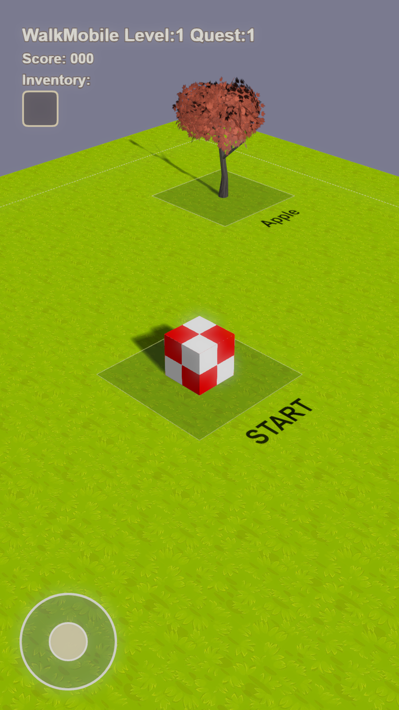

<!--
AI reading guide:
- Treat visible text as user-facing project documentation.
- Read the page from demo, to setup, to internals, to support.
- Keep commands consistent with Babylon/package.json.
- Keep authored lines at 80 characters or fewer.
- Keep the stable and versioned release routes documented under Live Demo.
-->

# Babylon Walking Mobile

<!-- AI: This introduction defines the project and its target platforms. -->

This demo project uses Babylon.js for a simple walking game that works with
WebGPU on PC and Mobile.

<!-- AI: This figure is the primary visual preview of the running game. -->

<figure>
  
  <figcaption>
    Image 1 - Babylon.js Game Engine - HTML5 + WebGPU
  </figcaption>
</figure>

<!-- AI: This section provides the public build and a support shortcut. -->

## Live Demo

https://samuelasherrivello.github.io/babylon-walking-mobile/releases/v0.05.2/

The verified link above opens `v0.05.2` directly. The stable newest-release
route is https://samuelasherrivello.github.io/babylon-walking-mobile/latest/.
Immutable builds are available under `/releases/<version>/` for replaying a
specific version.

WebGPU not working? See [Troubleshooting](#troubleshooting).

<!-- AI: This list maps the major visible sections in reading order. -->

## Table of Contents

1. [Live Demo](#live-demo)
2. [Getting Started](#getting-started)
3. [Project Overview](#project-overview)
4. [Project Details](#project-details)
5. [Troubleshooting](#troubleshooting)
6. [Resources](#resources)
7. [Credits](#credits)

<!-- AI: This section contains local setup, release, and command guidance. -->

## Getting Started

<!-- AI: Follow these steps to install, build, and run the project locally. -->

### Play Project

1. Clone or download this repo.
2. Open the repository root in a command line.
3. Run `npm install` to install the `Babylon` workspace dependencies.
4. Open the `Babylon` folder in the command line.
5. Run `npm run build` to build the project.
6. Run `npm start` to launch a local development server.
7. Run `npm run start:open` to open the app in Microsoft Edge.

<!-- AI: Keep this release process brief and numbered. -->

### Release Workflow

1. Create a GitHub Release with a version tag such as `v0.01`.
2. Wait for `ReleaseWebBuildToGithubPages` to finish.
3. Verify the published build from the Live Demo link.

<!-- AI: This table is the command reference for routine project work. -->

### More Commands

| # | Name | Command | Comment |
| --- | --- | --- | --- |
| 1 | Install | `npm install` | Run from the repository root. |
| 2 | Build | `npm run build` | Builds the app. |
| 3 | Start | `npm start` | Runs the app locally with hot reload. |
| 4 | Open (Edge Tab) | `npm run start:open` | Opens `http://localhost:5173`. |
| 5 | Check | `npm run check` | Checks TypeScript. |
| 6 | Test | `npm run run_unit_tests` | Runs unit tests. |

<!-- AI: This section summarizes the repository at a high level. -->

## Project Overview

This repo demonstrates browser-based game development with Babylon.js,
TypeScript, and WebGPU.

<!-- AI: This subsection identifies the primary documentation file. -->

### Documentation

- `README.md`: Primary documentation for this repo.

<!-- AI: This subsection identifies the main runtime technology. -->

### Configuration

- `Game Engine`: Babylon.js powers the 3D graphics and gameplay systems.

<!-- AI: This subsection maps important repository paths to their roles. -->

### Structure

- `Babylon`: Main project folder.
- `.github/workflows`: Release-triggered GitHub Pages publishing.
- `Babylon/public/index.html`: Entry HTML page.
- `Babylon/src/client/styles/`: CSS styling.
- `Babylon/src/client/scripts/`: Client TypeScript logic.
- `Babylon/src/client/scripts/index.ts`: Main game setup.
- `Babylon/src/tests/client/`: Unit tests.

<!-- AI: This subsection points to dependency and script metadata. -->

### Dependencies

- `package.json`: Defines the npm workspace.
- `Babylon/package.json`: Lists app dependencies and scripts.

<!-- AI: This section explains tools and the specification workflow. -->

## Project Details

<!-- AI: This list names recommended development and inspection tools. -->

### Editor Tooling

- Visual Studio Code: Source code editor.
- ESLint extension: Linting support for JavaScript and TypeScript.
- Error Lens extension: In-editor error and warning highlights.
- Babylon.js Inspector: Runtime scene inspection.

<!-- AI: This list summarizes the important installed packages. -->

### Code Packages

- `@babylonjs/core`: Babylon.js core 3D engine.
- `@babylonjs/loaders`: Babylon.js asset loaders.
- `vite`: JavaScript bundling and local dev server.
- `typescript`: TypeScript compiler.
- `eslint`: Linting for TypeScript.
- `vitest`: Unit testing for TypeScript.

<!-- AI: This table is the ordered OpenSpec change workflow. -->

### OpenSpec

[OpenSpec](https://openspec.dev/) keeps feature intent, implementation, and
current specifications aligned.

| # | Name | Command | Comment |
| --- | --- | --- | --- |
| 1 | Explore | `/opsx:explore` | Optional feature discovery and planning. |
| 2 | Propose | `/opsx:propose <name>` | Creates one focused feature change. |
| 3 | Apply | `/opsx:apply <name>` | Implements and completes one change. |
| 4 | Sync | `/opsx:sync <name>` | Updates main specs without archiving. |
| 5 | Archive | `/opsx:archive <name>` | Finalizes and archives a change. |

<!-- AI: This section starts with first-party checks, then other tools. -->

## Troubleshooting

<!-- AI: Use this flow when WebGPU rendering is unavailable. -->

### WebGPU not working?

First, open the [official WebGPU Samples hello-triangle
test](https://webgpu.github.io/webgpu-samples/?sample=helloTriangle). If that
does not render, the browser or device cannot currently run this project's
WebGPU path.

For Chrome-specific troubleshooting, see the official [WebGPU
documentation](https://developer.chrome.com/docs/web-platform/webgpu/). It
covers browser requirements, secure origins, graphics acceleration,
`chrome://gpu`, and the `enable-unsafe-webgpu` development flag.

Third-party references:

- [WebGPU Report](https://webgpureport.org/) shows the detected adapter,
  limits, and features.
- [WebGPU Fundamentals](https://webgpufundamentals.org/) explains compatibility
  mode and its experimental Chrome flag.
- [WebGPU Check](https://webgpucheck.com/) provides browser-specific enablement
  guidance and diagnostics.
- [Can I use: WebGPU](https://caniuse.com/webgpu) tracks current browser
  support, including mobile browsers.

<!-- AI: These links are authoritative learning and reference material. -->

## Resources

- [Babylon.js Documentation](https://doc.babylonjs.com/)
- [Babylon.js Playground](https://playground.babylonjs.com/)
- [Babylon.js Inspector](
  https://doc.babylonjs.com/toolsAndResources/inspector
  )
- [TypeScript Documentation](https://www.typescriptlang.org/docs/)

<!-- AI: This section records authorship, contact details, and licensing. -->

## Credits

<!-- AI: Preserve the creator attribution as written. -->

### Created By

- Samuel Asher Rivello
- Over 25 years of game development experience as of 2026

<!-- AI: These are the project's public creator contact links. -->

### Contact

- Twitter: <https://twitter.com/srivello/>
- Git: <https://github.com/SamuelAsherRivello/>
- Resume and portfolio: <http://www.SamuelAsherRivello.com>
- LinkedIn: <https://Linkedin.com/in/SamuelAsherRivello>

<!-- AI: This subsection states the repository's license and copyright. -->

### License

Provided as-is under the MIT License.
Copyright © 2026 Rivello Multimedia Consulting, LLC.
